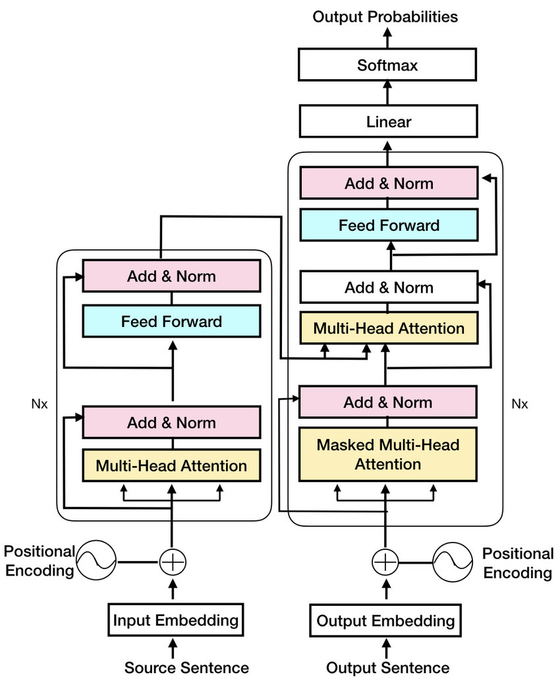

# LinguaTransform
**TransLingua** is a deep learning-based project that implements an **English to Hindi language** translator using the Transformer architecture.

## Introduction
The growing demand for **multilingual communication** has fueled the development of machine translation systems that can seamlessly translate text from one language to another. This project focuses on building an **English-to-Hindi language** converter using the **Transformer architecture**, a cutting-edge model in natural language processing (NLP). The Transformer, introduced in the paper **"Attention is All You Need,"** has revolutionized the field of NLP by enabling more accurate and efficient sequence-to-sequence tasks, such as language translation.

The objective of this project is to leverage the Transformer architecture to translate English sentences into Hindi. By utilizing advanced techniques like **self-attention, multi-head attention, and positional encoding,** the model aims to produce high-quality translations that are both contextually accurate and grammatically sound.

## Project Components
### Transformer Architecture**

### Encoder-Decoder Framework
-> The Transformer model is based on an **encoder-decoder architecture**. The encoder processes the input sequence (English sentence) and generates a set of            feature- rich representations. The decoder then uses these representations to produce the output sequence (Hindi sentence).

->Unlike traditional **sequence-to-sequence** models that rely on recurrent neural networks (RNNs), the Transformer model entirely eschews recurrence, relying         instead on self-attention mechanisms to capture dependencies between words, regardless of their positions in the sentence.

### Self-Attention Mechanism
->The **self-attention mechanism** allows the model to weigh the importance of each word in a sentence relative to other words. This is particularly crucial for       translation tasks, where the meaning of a word can depend on the context provided by the surrounding words.

->In the Transformer, self-attention is applied multiple times in parallel (multi-head attention), enabling the model to focus on different aspects of the         sentence simultaneously.

### Positional Encoding
->Since the Transformer model does not have a built-in mechanism to handle the order of words (unlike RNNs), it uses **positional encoding** to inject information     about the position of each word in the sequence.

->**Positional encodings** are added to the word embeddings, providing the model with a sense of word order, which is essential for understanding the structure of     the sentence.

## Key Modules
### Sentence Embedding
Converts input sentences into dense vectors (embeddings) that capture the semantic meaning of the words. This module also incorporates special tokens like the start token <START>, end token <END>, and padding token <PAD>, which help the model handle sentences of varying lengths.

Embeddings are enhanced by adding positional encodings to ensure the model considers word order during translation.
Positional Encoding

Generates positional encodings that are combined with word embeddings to maintain the sequence information. These encodings use sine and cosine functions of different frequencies, ensuring each position has a unique encoding.

### Multi-Head Attention
A core component of both the encoder and decoder, it splits the input into multiple heads, each applying self-attention independently. The results are concatenated and linearly transformed to produce the final output, capturing various aspects of the sentence, such as syntactic structure and semantic relationships.

### Layer Normalization
Applied after the attention and feed-forward layers to **stabilize and accelerate training**. It normalizes the output across the feature dimension, ensuring consistent scale in activations.

### Feed-Forward Network
Applies two linear transformations with a **ReLU activation in between**. This module introduces non-linearity, allowing the model to learn complex mappings from input to output.

## Cross-Attention Mechanism
In the decoder, this mechanism aligns the encoder's output (English sentence representation) with the decoder's input (partially generated Hindi sentence), ensuring the translation aligns contextually with the source sentence.

## Dataset
### Parallel Corpus
Utilizes a parallel corpus containing English-Hindi sentence pairs. The dataset is pre-processed to tokenize the sentences, converting them into sequences of integers corresponding to the words in the vocabulary, with special tokens like <START>, <END>, and <PAD> added to each sequence.

### Tokenization
A dedicated script converts the English and Hindi sentences into token sequences. Each token is mapped to an index based on the vocabulary, allowing the model to process sentences as numerical data.

## Training Process
### Transformer Trainer
Manages the training process, including data loading, model initialization, forward pass, loss calculation, and backpropagation. It also optimizes model parameters using techniques like learning rate scheduling and gradient clipping.

### Evaluation
Performance is evaluated using metrics such as BLEU score, measuring translation accuracy by comparing predicted sentences to reference translations. The model is also tested on unseen sentences to assess generalization capabilities.

## Implementation Files
### Sentence Tokenization File
Handles the tokenization of input sentences, converting them into sequences of indices for both English and Hindi languages.
Transformer Trainer File

Contains the logic for training the Transformer model, including functions for loading the dataset, initializing the model, performing the forward pass, computing the loss, and updating model parameters.

## Sample Dataset
hindi_sentences and english_sentences.txt format sample dataset containing parallel English and Hindi sentences for training and evaluation.

## Conclusion
This project demonstrates the power and flexibility of the Transformer architecture in handling complex language translation tasks. By utilizing advanced mechanisms like multi-head attention, positional encoding, and cross-attention, the model can accurately translate English sentences into Hindi, capturing both the context and nuances of the language.

The provided documentation, implementation files, and sample dataset serve as a comprehensive guide for those interested in exploring the capabilities of Transformers in NLP. Whether you're a researcher, developer, or language enthusiast, this project offers valuable insights into building and training a state-of-the-art translation model.

## Insight
### Unit Preservation in Training:
Treat each alphabet as a single unit instead of decomposing it into its individual components. For instance, "मा" should be considered as one unit when computing loss, rather than splitting it into "म" and "ा". This helps in preserving the semantic integrity of the text.

### Tokenization Strategy:
Implement word-based or Byte Pair Encoding (BPE) tokenizations to mitigate the risk of losing meaning through decomposition. This approach will help in generating valid word units, which is crucial for accurate translations.

### Diverse Training Dataset:
Ensure that your training dataset includes a wide variety of sentences covering different topics, rather than focusing on a single theme like "work" or "government". This diversity is key to improving the model's ability to generalize and produce accurate translations across various contexts.

### Model Architecture:
Increase the number of encoder and decoder units in your Transformer model. While the current configuration may have been set to the minimum of 1 encoder and 1 decoder, expanding this will allow for better processing of complex language structures and improve translation quality.

### Language Familiarity:
When developing and testing the translator, use a language that you understand well. This familiarity will help in better evaluating the translations and making necessary adjustments.

## Current Status
The LinguaTransformer project, which focuses on English-to-Hindi translation using Transformer architecture, is currently under maintenance due to several factors, including:

Insufficient Datasets: The existing datasets are not comprehensive enough to fully train the model, particularly for complex linguistic tasks such as capturing contextual nuances and maintaining grammatical accuracy.

Limited Processing Capacity: The current computational resources are insufficient to support the intensive training required for the model to effectively translate complex sentences and grasp subtle language structures.

## Ongoing Development
We believe that a significant increase in data volume, along with enhanced processing capabilities, is essential to train LinguaTransformer effectively. The ongoing development efforts are focused on addressing these limitations to improve the model's translation accuracy and performance, aiming for more contextually rich and grammatically sound outputs.

## Future Work
#### Hyperparameter Tuning
Experiment with different hyperparameter configurations, such as the number of attention heads, the depth of the encoder and decoder, and the learning rate, to optimize the model's performance.

### Dataset Expansion
Expand the dataset by incorporating more diverse and challenging sentence pairs, including idiomatic expressions, formal and informal speech, and domain-specific language, to improve the model's robustness.

### Real-Time Translation
Integrate the trained model into a real-time translation application (e.g., web or mobile app) to provide instant translation services, optimizing the model for deployment on edge devices or in cloud environments.

### Multilingual Support
Extend the model's capabilities to support multiple languages beyond English and Hindi, training on additional language pairs for cross-lingual communication.

